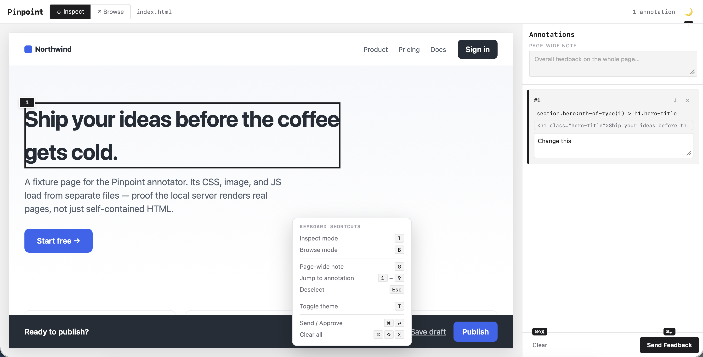
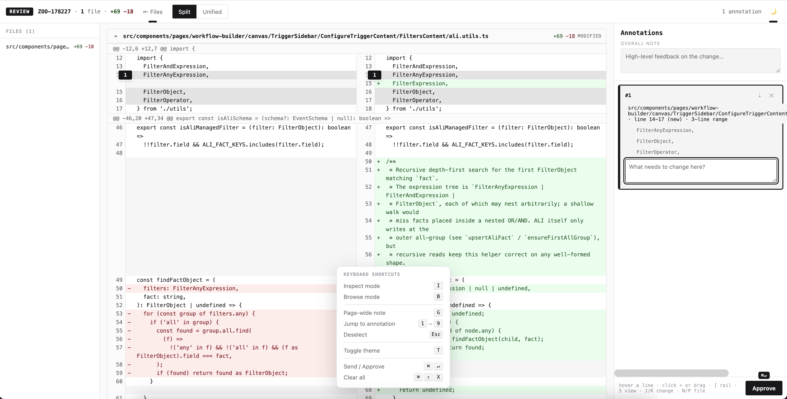
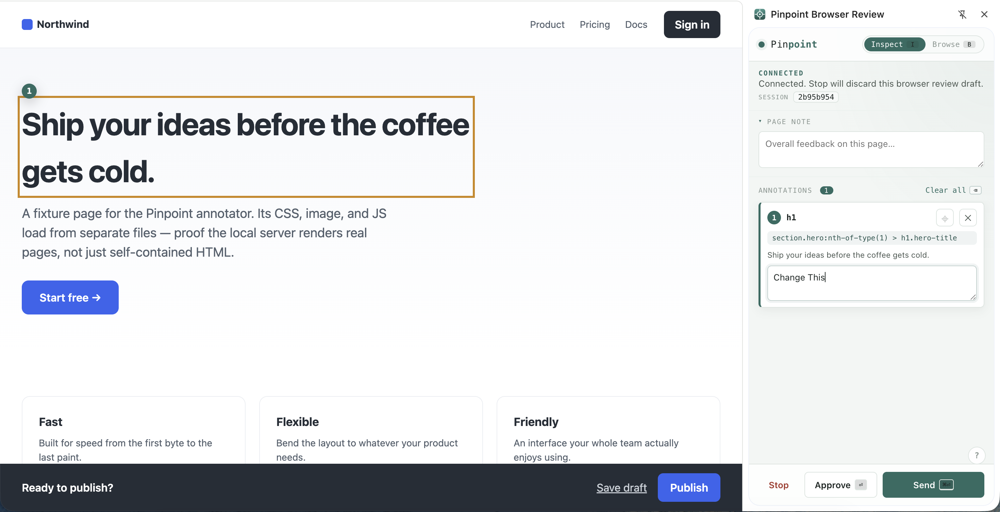

# Pinpoint

**Visual HTML, Markdown & diff annotator for [Claude Code](https://docs.anthropic.com/en/docs/claude-code).**

Run `/pinpoint <file>`, `/pinpoint review`, or `/pinpoint browser`, click elements or lines to leave anchored comments, then **Send Feedback** or **Approve** — the result returns to your Claude Code session as a structured brief. Works on `.html` files, `.md` plans/specs, the working-tree diff (`git diff HEAD`), and live Chrome tabs.

Local-only, no cloud, no accounts, no telemetry.

---

## Screenshots

**File review** — annotate any `.html` or `.md` file directly in the browser:



**Code review** — annotate the working-tree diff line-by-line, GitHub-PR-style:



**Browser review** — annotate a live Chrome tab via the side panel extension:



---

## Install

**Ask Claude Code (recommended):**
> install https://github.com/vinitkumargoel/pinpoint

**Or with one command:**
```bash
curl -fsSL https://raw.githubusercontent.com/vinitkumargoel/pinpoint/main/scripts/install.sh | bash
```

Installs the `pinpoint` CLI, the `/pinpoint` slash command, and a skill so Claude reaches for it automatically. Requires [Bun](https://bun.sh) ≥ 1.1 and `git`. Make sure `~/.local/bin` is on your `PATH`.

**Update:** re-run the same curl command, or tell Claude **"update pinpoint"**.

**Uninstall:**
```bash
curl -fsSL https://raw.githubusercontent.com/vinitkumargoel/pinpoint/main/scripts/uninstall.sh | bash
```

---

## Use

### File review

```
/pinpoint path/to/PLAN.html
/pinpoint path/to/PLAN.md
```

Blocks the Claude session, opens the annotator in your browser, and resumes once you finalize. Markdown files are rendered to a styled HTML document. Also works from a terminal: `pinpoint annotate <file>`.

### Code review (working-tree diff)

```
/pinpoint review
```

Renders `git diff HEAD` (staged + unstaged together) as a split-view code review page in the annotator, with a collapsible file rail, Split/Unified toggle, and `[ S J K N P` keyboard navigation. Click any line on either side to attach a comment. Each annotation in the brief carries `data-file`, `data-new-line`, `data-old-line`, and `data-kind` so Claude can resolve the exact location without parsing selectors.

`No changes to review.` exits 0 silently in a clean repo. Diffs above the ~5,000-line ceiling are refused with a "narrow scope or split commits" message. Untracked files aren't rendered (yet) but their count appears as a banner.

### Browser review (Chrome extension)

Use when the page to review is already open in Chrome — a local dev app, staging URL, or any authenticated route.

```
/pinpoint browser
```

Then open the Pinpoint side panel on the tab you want, click **Start**, annotate, and send. Each annotation gets its own focused screenshot (the page scrolls to each element before capture).

**Install the extension:**
```bash
cd ~/.local/share/pinpoint && bun run build:extension
```
Open `chrome://extensions` → **Developer mode** → **Load unpacked** → select `dist/extension`.

### Concurrent reviews

Each `pinpoint annotate` gets its own random port and browser tab. Run as many as you like:
```bash
pinpoint list
```

### How it ends

| Action | Claude receives |
|---|---|
| **Send Feedback** (file) | `# UI Feedback` brief with page note, annotations (selector, element HTML, comment, screenshot per annotation) |
| **Send Feedback** (review) | `# Code Review Feedback` brief with annotations carrying `data-file` / `data-new-line` / `data-old-line` / `data-kind` in their HTML block |
| **Approve** | `✅ Approved — no changes requested.` |
| **Close tab** | `Review window closed — no feedback submitted.` |
| **Empty diff** | `No changes to review.` (review only, exit 0) |
| **Ctrl+C** | aborts (exit 130) |

Annotations survive a page reload (stored in `sessionStorage`); closing the tab ends the session.

---

## Develop from source

```bash
git clone https://github.com/vinitkumargoel/pinpoint.git
cd pinpoint && bun install
bun run install:local    # point the local shim at this working tree
```

```bash
bun run build:ui                                 # bundle src/ui → src/ui/annotator.html
bun run build:extension                          # copy src/extension → dist/extension
bun run dev -- annotate test/fixture/index.html  # run the CLI
bun run typecheck                                # tsc --noEmit
bun test                                         # headless smoke tests
bun run compile                                  # → dist/pinpoint (standalone binary)
```

### Layout

```
src/
  index.ts              entry (#!/usr/bin/env bun)
  commands/annotate.ts  file review: start server → open browser → await → print
  commands/browser-session.ts  browser review command
  commands/review.ts    diff review: git diff HEAD → render → annotate → print
  diff.ts               unified-diff parser + split/unified HTML renderer
  server.ts             static file server + /__pinpoint API
  extension/            Chrome extension (MV3 side panel)
  ui/                   annotator app source (index.html + app.css + app/*.ts)
commands/pinpoint.md    /pinpoint slash command
skills/pinpoint/        Pinpoint skill for Claude
scripts/                build, install, uninstall helpers
test/                   headless smoke tests + fixture page
```

---

## License

[MIT](LICENSE) © Vinit Kumar
